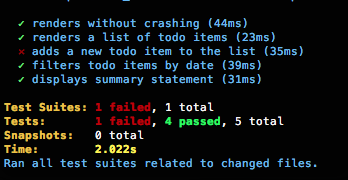

## Challenge: build tedâ.is

 ## [Design Comp](https://projects.invisionapp.com/share/3ZBHFSYFD#/screens/231128068)

#### Review the test suite and make it green

Four of the 5 tests are currently passing.

When trying to make the `adds a new todo item to the list` test pass, I wanted to first simulate a click of the add button, followed by a simulation of the input of a new task, then a simulation of a click of the `Add` button.

#### Replace the `todos.json` data source with json-server

On the `server` branch, json-server is implemented in the `src/db.json` file. I was able to access endpoints for both all and individual `todos` through `http://localhost:3000/todos` and endpoints such as  `http://localhost:3000/todos/1`. I did run into an error when trying to fetch all of the todos from the server with a GET request to `http://localhost:3000/todos` that read `Unexpected token < in JSON at position 0`. At first, I thought that the response was not coming back in JSON format -- but a console.log disproved that theory. Perhaps I need to be parsing the result of that request?

#### Replace “yesterday” and “tomorrow” terminology with “01 May”
In order to work around Moment's mutability, I needed to clone the current date, format it to add or subtract a day and assign it to `tomorrow` and `yesterday` respectively:  
`const yesterday = date.clone().subtract(1, 'day')` 
`const tomorrow = date.clone().add(1, 'day')` 
From that point, I simply replaced the `yesterday` and `tomorrow` link text with my previously calculated constants and formatted them to the desired date-month format mentioned in the spec.

#### Make “today” a link and match the style of “yesterday” and “tomorrow” as seen in the prototype
This was accomplished by utilizing the font-size, font-weight, and color CSS properties for the `.previous` and `.next` links.

#### Add the ability to create new TODO's
Applying an `autoFocus` attribute to the input field that is rendered when the state of adding is set to `true` allows the user to type in a new TODO. I also added an `Add` button to allow the user to submit their TODO. When the `Add` button is clicked, it calls the `click` prop that was passed down when the `CreateItemButton` component was rendered within the `List` component in `List.js`. From that point, it accesses the `createNewItem` prop that was passed down when the `List` component was rendered within the `App` component. That calls and binds the `_createNewItem` function and sets the state of `items` to match the information that was given. If given more time, I would have the item's description render what the user input value was rather than a default `New Item` description.

#### Match the style of each TODO item, including hover state
I attempted to match the style of the TODO items by starting with the hover state. I got as far as applying some magnifying features on hover including a box-shadow effect that still needs some tweaks to it. Positioning did not happen to be my friend in this case. I was hoping that by setting the `.List li:hover's` width to 100%, the style would span the with of the `ul` container.

#### Add the ability to delete and complete TODO items
I started by creating a component for the delete button that I hoped to render with every TODO. From there, I would have included a delete function that would be triggered on the click of the delete button. That function would find the parent of that button and delete that TODO.

In theory, the complete function would work in a similar fashion, but would apply a class of 'completed' to the specified TODO. This class would then trigger a visual indicator that this TODO has been completed.

#### Add missing prop types declarations
While I have not done much work with prop type declarations, I would have ventured to guess that I would need to specify that `todos` would be an object prop type. The `_today`, `_previous`, and `_next` functions would be declared as functions. This is definitely and area that I need to explore further.
